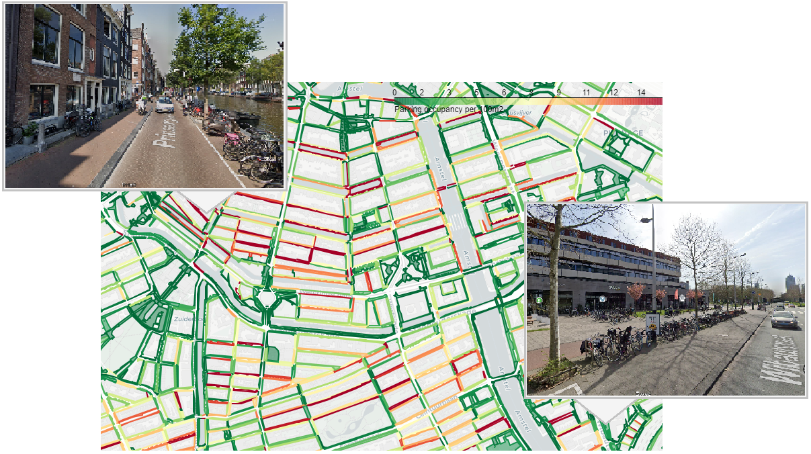

# Analysing and Predicting Micromobility Parking

This repository contains all code that was written during my thesis project for the MSc Data Science at the UvA in collaboration with the City of Amsterdam. The aim of this project was to use historical data on the number of parked micromobility vehicles, along with neighborhood characteristics, to analyze and predict the parking occupancy on the sidewalks. 

During the first part of this project a cluster analysis was done with the goal to identify spatial variations in the parking occupancy of micromobility vehicles with regard to neighborhood characteristics. The second part focused on training several machine learning models to predict the parking occupancy on the sidewalks using historical parking data, neighborhood characteristics and cluster results.

---

## Data

Various data sources were used during this project. The main dataset is the micromobility parking dataset provided by Trajan. This dataset is not publicly available and can be requested by the municipality of Amsterdam. In addition, the following open source datasets concerning various neighborhood characteristics were used:
-	Points of interest (non-residential functions): https://maps.amsterdam.nl/open_geodata/?k=49
-	Points of interest (horeca): https://data.amsterdam.nl/datasets/GsY50tEkoJKCGw/
-	Land use: https://maps.amsterdam.nl/open_geodata/?k=310
-	Public transport: https://maps.amsterdam.nl/open_geodata/?k=381
-	Shopping areas: https://maps.amsterdam.nl/open_geodata/?k=123

---

## How it works

The ‘src’ folder contains the notebooks with the code written during this project. The code consists of several notebooks that should be executed in the following order:
1.	Pre-processing parking data: This notebook prepares the micromobility parking data. This includes dealing with missing values, removing outliers, transforming the data, and extracting features.
2.	Preprocessing and merging neighborhood data: This notebook prepares the neighborhood datasets. After preparation, the data sets are merged with the parking data based on their geometric information.
3.	Clustering and regression modelling: This notebook performs a cluster analysis of the aggregated parking and neighborhood data. In addition, three regression models (random forest, XGBoost and multilayer perceptron) were trained using different combinations of features to predict the parking occupancy of micromobility vehicles on the sidewalk.

---
## Contact

Johanna Fiebag, johanna.fiebag@gmail.com

